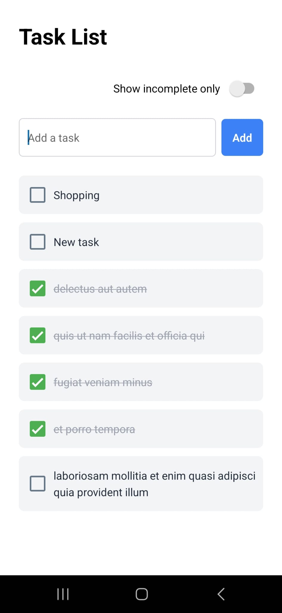
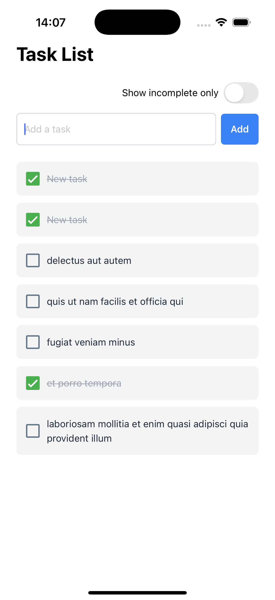

# 📋 Task List

A simple and responsive task management app built with [Expo](https://expo.dev), using React Native and NativeWind. You can add tasks, mark them complete/incomplete, and filter to show only what’s pending.

## 🚀 Getting Started

### 1. Install dependencies

```bash
npm install
```

### 2. Run the app

```bash
npx expo start
```

This will open the Expo Developer Tools in your browser where you can choose to run the app:

- on an **Android emulator**
- in an **iOS simulator**
- using **Expo Go** on your physical device

---

## 🖼 Screenshots

| Android | iOS |
|--------|-----|
|  |  |

---

## 🛠 Features

- Add new tasks
- Mark tasks as complete/incomplete
- Filter to show only incomplete tasks
- Responsive layout for different screen sizes
- Styled using NativeWind (Tailwind for React Native)

---

## 🧪 Running Tests

To run unit and component tests:

```bash
npm test
```

We use [Jest](https://jestjs.io/) and [Testing Library](https://callstack.github.io/react-native-testing-library/) for testing.

---


## 📚 Learn More

- [Expo Documentation](https://docs.expo.dev/)
- [React Native](https://reactnative.dev/)
- [NativeWind](https://www.nativewind.dev/)

---
